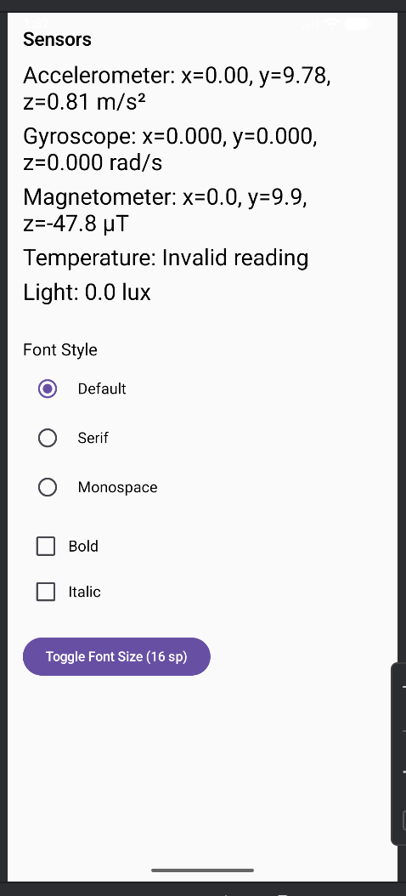

# Sensor Data Dashboard with Jetpack Compose & DataStore

A modern Android application built with **Kotlin** and **Jetpack Compose** that displays real-time sensor data from your device, including:

- **Accelerometer**  
- **Gyroscope**  
- **Magnetometer**  
- **Ambient Temperature**  
- **Light Sensor (Lux)**  

The app also features **persistent UI customization** using **DataStore Preferences**, allowing users to:

- Toggle **font size** (16sp ↔ 24sp)  
- Choose **font family** (Default, Serif, Monospace)  
- Enable **Bold** and **Italic** text styles  

All preferences are **saved across app restarts**.

---

## Features

| Feature | Description |
|-------|-----------|
| **Real-time Sensor Updates** | Live data from 5 hardware sensors |
| **Jetpack Compose UI** | Declarative, responsive, and modern design |
| **DataStore Preferences** | Persistent font settings |
| **Bold & Italic Support** | Toggle via checkboxes |
| **Font Style Selection** | Radio buttons for Default / Serif / Monospace |
| **Emulator-Friendly** | Works perfectly in Android Emulator with Extended Controls |

---

## Screenshots

 | | 

---

## Tech Stack

- **Language**: Kotlin  
- **UI**: Jetpack Compose (Material3)  
- **State Management**: `MutableState`, `LaunchedEffect`, `produceState`  
- **Persistence**: `DataStore` (Preferences)  
- **Sensors**: Android `SensorManager`  
- **Coroutines**: `kotlinx-coroutines-android`

---

## Dependencies (build.gradle.kts)

```kotlin
implementation("androidx.activity:activity-compose:1.8.2")
implementation("androidx.compose.ui:ui:1.6.1")
implementation("androidx.compose.material3:material3:1.2.0")
implementation("androidx.lifecycle:lifecycle-runtime-ktx:2.6.2")
implementation("org.jetbrains.kotlinx:kotlinx-coroutines-android:1.7.3")
implementation("androidx.datastore:datastore-preferences:1.0.0")
